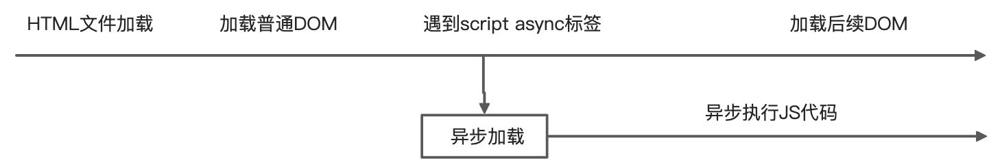
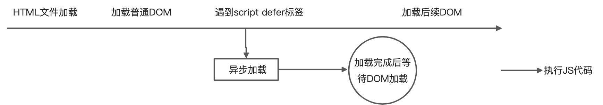
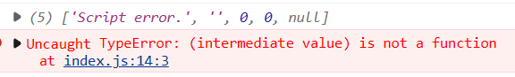
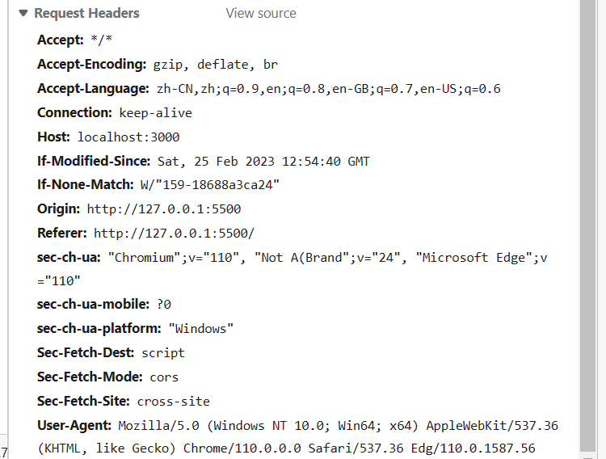
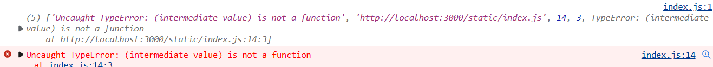
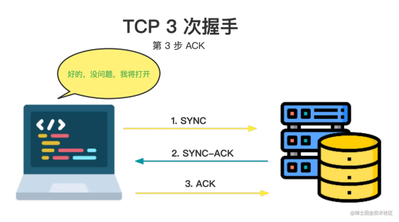
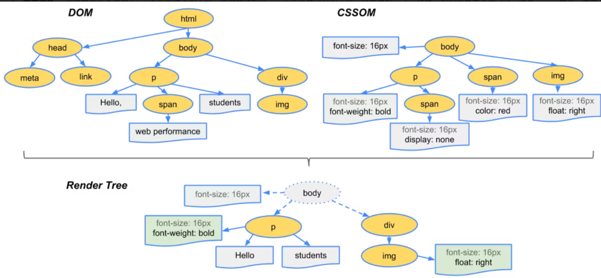

## 代码题：

实现一个类：运行能输出 '你好，我是小明' , 两秒后输出'小明吃苹果'
此处的队列使用的是自己封装基于数组的[Queue](https://www.yuque.com/u25317811/tsotte/qbyrpr#Z5JFG)

```javascript
// 实现一个类：运行能按输出 '你好，我是小明' , 两秒后输出'小明吃苹果'
//const xiaoming = new Persion('小明')
//xiaoming.sayHi('你好').sleep(2).eat('苹果')
// 见： https://gitee.com/gao_xincheng/short-demo/blob/master/sleep.js
// 写法1
class Person {
  constructor(name) {
    this.name = name;
    this.personQueue = new Queue();
    this.isRunning = false;
  }
  async clearPersonQueue() {
    if (this.personQueue.size() && !this.isRunning) {
      this.isRunning = true;
      await this.personQueue.front()();
      this.personQueue.dequeue();
      this.isRunning = false;
      this.clearPersonQueue();
    }
  }
  sayHi(message) {
    this.personQueue.enqueue(() => {
      console.log(`${message}, 我是${this.name}`);
    });
    this.clearPersonQueue();
    return this;
  }

  sleep(time) {
    this.personQueue.enqueue(() => {
      console.log("开始睡觉~~");
      return new Promise((resolve) => {
        setTimeout(() => {
          console.log("睡醒了~~");
          resolve();
        }, time * 1000);
      });
    });
    this.clearPersonQueue();
    return this;
  }

  eat(food) {
    this.personQueue.enqueue(() => {
      console.log(`${this.name}吃${food}`);
    });
    this.clearPersonQueue();
    return this;
  }
}

//写法2
class Person {
  list = []; //这个列表只装未执行的resolve
  isRunning = false;
  constructor() {}
  sayHi(message) {
    this.add(async () => {
      console.log(`小明说${message}`);
    });
    return this;
  }
  sleep(time) {
    this.add(async () => {
      return new Promise((resolve) => {
        setTimeout(() => {
          resolve();
        }, time * 1000);
      });
    });
    return this;
  }
  eat(food) {
    this.add(() => {
      console.log(`小明eat${food}`);
    });
    return this;
  }
  async add(fn) {
    this.isRunning
      ? await new Promise((resolve) => {
          this.list.push(resolve);
        })
      : "";
    this.isRunning = true;
    await fn();
    this.isRunning = false;
    if (this.list.length > 0) {
      this.list.shift()();
    }
  }
}
```

```javascript
/**
 * 编写一个异步任务调度器
 */
class Scheduler {
  list = []; //用来承载还未执行的异步

  count = 0; //用来计数

  constructor(num) {
    this.num = num; //允许同时运行的异步函数的最大个数
  }

  async add(fn) {
    this.count >= this.num
      ? await new Promise((resolve) => {
          this.list.push(resolve);
        })
      : "";

    this.count++;

    const result = await fn();

    this.count--;

    if (this.list.length > 0) {
      this.list.shift()();
    }

    return result;
  }
}

module.exports = Scheduler;
```

## vue 的数据双向绑定

[MVVM 原理](https://www.yuque.com/u25317811/tsotte/fy5ilx?view=doc_embed)

## http1 到 http2 增加了什么内容

http2 相较于 http1.1 的优势：

- 多路复用
- 头部压缩
- 服务器推送

查看：[https://www.yuque.com/u25317811/tsotte/pv653g#FhHzd](https://www.yuque.com/u25317811/tsotte/pv653g#FhHzd)

参考：[https://juejin.cn/post/6857287743966281736](https://juejin.cn/post/6857287743966281736)

## script 标签中 defer 和 async

- 最普通的 script 标签，一切都会同步执行，加载到 script 标签之后会等待 script 资源加载完成并执行完成才会加载后面的 DOM


- async: 对于普通脚本，如果存在 async 属性，那么普通脚本会被并行请求，并尽快解析和执行（异步请求和执行，不耽误 DOM 渲染）。



- defer: 这个布尔属性被设定用来通知浏览器该脚本将在文档完成解析后，触发 [DOMContentLoaded (en-US)](https://developer.mozilla.org/en-US/docs/Web/API/Window/DOMContentLoaded_event) 事件前执行。

有 defer 属性的脚本会阻止 DOMContentLoaded 事件，直到脚本被加载并且解析完成。


### crossorigin 属性

如果没设置 script 是可以跨域请求资源的，但是出于安全策略无法在 window.onError 中获取详细的报错信息

如果设置了`crossorigin`，默认为`anonymous`，此时获取资源会携带 Origin 和要求 cors 验证，这时跨域了就会报错。后台设置允许 cors 后方可获取资源，并且 window.onError 可以获取详细的报错信息



> [script crossorigin 属性 - 掘金](https://juejin.cn/post/6969825311361859598)

## ES6 的 Proxy

[Proxy](https://www.yuque.com/u25317811/tsotte/mza0hv?view=doc_embed)

## 项目中有什么难点，如何解决

## 浏览器输入 URL 到页面展示经历了什么

**1、解析 URL:** 首先会对 URL 进行解析，分析所需要使用的传输协议和请求的资源的路径。如果输入的 URL 中的协议或者主机名不合法，将会把地址栏中输入的内容传递给搜索引擎。如果没有问题，浏览器会检查 URL 中是否出现了非法字符，如果存在非法字符，则对非法字符进行转义后再进行下一过程。

**2、缓存判断**：浏览器会判断所请求的资源是否在缓存里，如果请求的资源在缓存里并且没有失效，那么就直接使用，否则向服务器发起新的请求。

**3、DNS 解析**： 下一步首先需要获取的是输入的 URL 中的域名的 IP 地址，首先会判断本地是否有该域名的 IP 地址的缓存，如果有则使用，如果没有则向本地 DNS 服务器发起请求。本地 DNS 服务器也会先检查是否存在缓存，如果没有就会先向根域名服务器发起请求，获得负责的顶级域名服务器的地址后，再向顶级域名服务器请求，然后获得负责的权威域名服务器的地址后，再向权威域名服务器发起请求，最终获得域名的 IP 地址后，本地 DNS 服务器再将这个 IP 地址返回给请求的用户。用户向本地 DNS 服务器发起请求属于递归请求，本地 DNS 服务器向各级域名服务器发起请求属于迭代请求。

**4、获取 MAC 地址:** 当浏览器得到 IP 地址后，数据传输还需要知道目的主机 MAC 地址，因为应用层下发数据给传输层，TCP 协议会指定源端口号和目的端口号，然后下发给网络层。网络层会将本机地址作为源地址，获取的 IP 地址作为目的地址。然后将下发给数据链路层，数据链路层的发送需要加入通信双方的 MAC 地址，本机的 MAC 地址作为源 MAC 地址，目的 MAC 地址需要分情况处理。通过将 IP 地址与本机的子网掩码相与，可以判断是否与请求主机在同一个子网里，如果在同一个子网里，可以使用 APR 协议获取到目的主机的 MAC 地址，如果不在一个子网里，那么请求应该转发给网关，由它代为转发，此时同样可以通过 ARP 协议来获取网关的 MAC 地址，此时目的主机的 MAC 地址应该为网关的地址。

**5、TCP 三次握手:** 下面是 TCP 建立连接的三次握手的过程，首先客户端向服务器发送一个 SYNC（SYNChronization：同步请求） 连接请求报文段和一个随机序号，服务端接收到请求后向客户端发送一个 SYN ACK（SYNChronization 和 ACKnowledgement）报文段，确认连接请求，并且也向客户端发送一个随机序号。客户端接收服务器的确认应答后，进入连接建立的状态，同时向服务器也发送一个 ACK 确认报文段，服务器端接收到确认后，也进入连接建立状态，此时双方的连接就建立起来了。


**6、HTTPS 握手:** 如果使用的是 HTTPS 协议，在通信前还存在 TLS 的一个四次握手的过程。首先由客户端向服务器端发送使用的协议的版本号、一个随机数和可以使用的加密方法。服务器端收到后，确认加密的方法，也向客户端发送一个随机数和自己的数字证书。客户端收到后，首先检查数字证书是否有效，如果有效，则再生成一个随机数，并使用证书中的公钥对随机数加密，然后发送给服务器端，并且还会提供一个前面所有内容的 hash 值供服务器端检验。服务器端接收后，使用自己的私钥对数据解密，同时向客户端发送一个前面所有内容的 hash 值供客户端检验。这个时候双方都有了三个随机数，按照之前所约定的加密方法，使用这三个随机数生成一把秘钥，以后双方通信前，就使用这个秘钥对数据进行加密后再传输。

**7、返回数据:** 当页面请求发送到服务器端后，服务器端会返回一个 html 文件作为响应，浏览器接收到响应后，开始对 html 文件进行解析，开始页面的渲染过程。

**8、页面渲染：** 浏览器首先会根据 html 文件构建 DOM 树，根据解析到的 css 文件构建 CSSOM 树，如果遇到 script 标签，则判端是否含有 defer 或者 async 属性，要不然 script 的加载和执行会造成页面的渲染的阻塞。当 DOM 树和 CSSOM 树建立好后，根据它们来构建渲染树。渲染树构建好后，会根据渲染树来进行布局。布局完成后，最后使用浏览器的 UI 接口对页面进行绘制。这个时候整个页面就显示出来了。[https://web.dev/critical-rendering-path-render-tree-construction/](https://web.dev/critical-rendering-path-render-tree-construction/)


**9、TCP 四次挥手：** 最后一步是 TCP 断开连接的四次挥手过程。若客户端认为数据发送完成，则它需要向服务端发送连接释放请求。服务端收到连接释放请求后，会告诉应用层要释放 TCP 链接。然后会发送 ACK 包，并进入 CLOSE_WAIT 状态，此时表明客户端到服务端的连接已经释放，不再接收客户端发的数据了。但是因为 TCP 连接是双向的，所以服务端仍旧可以发送数据给客户端。服务端如果此时还有没发完的数据会继续发送，完毕后会向客户端发送连接释放请求，然后服务端便进入 LAST-ACK 状态。客户端收到释放请求后，向服务端发送确认应答，此时客户端进入 TIME-WAIT 状态。该状态会持续 2MSL（最大段生存期，指报文段在网络中生存的时间，超时会被抛弃） 时间，若该时间段内没有服务端的重发请求的话，就进入 CLOSED 状态。当服务端收到确认应答后，也便进入 CLOSED 状态。

## vue 的 diff 算法

[https://juejin.cn/post/6994959998283907102](https://juejin.cn/post/6994959998283907102)

## HTTP 缓存原理

[HTTP](https://www.yuque.com/u25317811/tsotte/pv653g?view=doc_embed&inner=iQp1c)

## cdn 加速原理

[https://baijiahao.baidu.com/s?id=1706310290554711159&wfr=spider&for=pc](https://baijiahao.baidu.com/s?id=1706310290554711159&wfr=spider&for=pc)

## JavaScript 较复杂的任务怎么处理

时间分片

## type 和 interface 的区别

### 共同点：

- 都可以声明对象，函数

```typescript
type Obj1 = {name: string}
type Fuc1 = (name: string)=>string

interface Obj2 {name: string}
interface {
  (name: string): string
}
```

- 都可以继承

```typescript
type Obj3 = Obj1 & { name: string }; // 注意后面的不能覆盖前面的属性，如果重写的属性不同则会出现number & string这种结果就是never

interface Obj4 extends Obj2 {
  name: number;
  age: number;
}
// interface接口继承重写属性必须是前者的子类型，否则报错
```

### 不同点：

type：

- type 可以定义类型别名，如:

```typescript
type a = string;
type b = a;
```

- type 可以定义联合类型
- type 可以定义元组：`type tupl = [string, number]`
- type 可以通过 typeof 操作符定义：`type Obj = typeof { name: '发' }`

interface：

- interface 可以**声明合并**

[https://blog.csdn.net/weixin_43550562/article/details/123546720](https://blog.csdn.net/weixin_43550562/article/details/123546720)

## 重绘（repaint）和重排（reflow）的概念

[https://juejin.cn/post/7117607113966223368/](https://juejin.cn/post/7117607113966223368/)

> 参考: [https://www.jianshu.com/p/26e99c590701](https://www.jianshu.com/p/26e99c590701) > [https://www.jianshu.com/p/2a5d43476c11](https://www.jianshu.com/p/2a5d43476c11)

## webpack 的 loader 和 plugin 的区别

- loader 是文件加载器，能够加载资源文件，并对这些文件进行一些处理，诸如编译、压缩等，最终一起打包到指定的文件中

- plugin 赋予了 webpack 各种灵活的功能，例如打包优化、资源管理、环境变量注入等，目的是解决 loader 无法实现的其他事

  > 参考[https://vue3js.cn/interview/webpack/Loader_Plugin.html](https://vue3js.cn/interview/webpack/Loader_Plugin.html)

## 深拷贝浅拷贝

### 浅拷贝

- Object.assing(只对对象)
- Array.prototype.concat(只对数组)
- Array.prototype.slice(只对数组)
- 扩展运算符

### 深拷贝

#### JSON.stringify()

:::success
优点：使用简单，效率高不需要遍历递归
缺点：当拷贝内容包含 Function、Date、Symbol 等数据会丢失，因此只能拷贝对象数组和基本类型的数据
:::

#### lodash 的 deepClone

实际开发中的最优解

#### structuredClone

ES6 最新 api，兼容性非常差不过有 polyfill

- 不能克隆函数

#### 手写递归深拷贝

[常见手写题](/front-end/interview-questions/handwritten-code.html#%E6%B7%B1%E6%8B%B7%E8%B4%9D)

## CSS 中 伪类 和 伪元素 的区别

### 主要区别

伪类： 应用于元素的特定状态

伪元素：应用于元素中的虚拟元素

常见伪类：

- :hover
- :active
- :focus
- :link
- :visited
- :first-child
- :last-child
- :nth-child(n)
- :nth-last-child(n)
- :nth-of-type(n)
- :nth-last-of-type(n)
- :first-of-type
- :last-of-type
- :only-child

常见伪元素：

- ::before
- ::after
- ::first-line
- ::first-letter
- ::selection
- ::placeholder
- ::empty
- ::root
