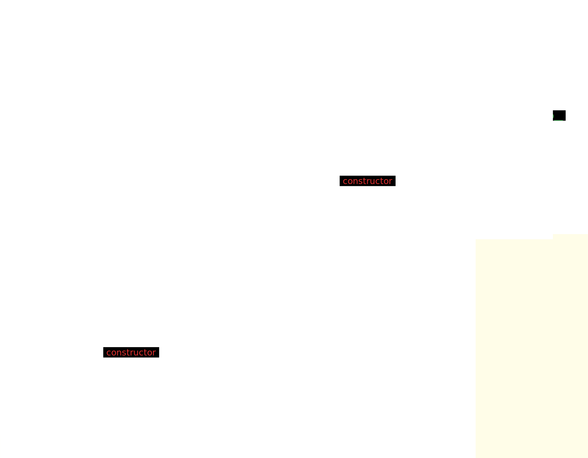

# 原型链

## 原型链注意点

- 实例的`__proto__`指向构造函数的`prototype`

- `__proto__`不推荐直接使用，建议使用`Object.getPrototypeOf()`获取原型

- `constructor`属性存在于原型上

- 所有函数的构造函数都是`Function`，因此`Function`的构造函数是`Function`

- 在 JavaScript 中，几乎所有内置构造函数的原型最终都指向 `Object.prototype`，即都是Object的实例

