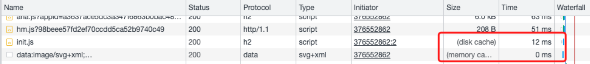
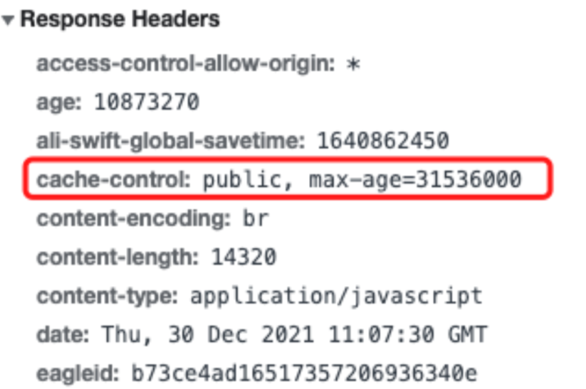
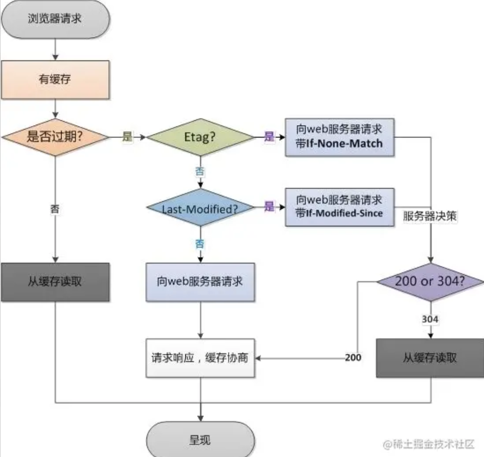
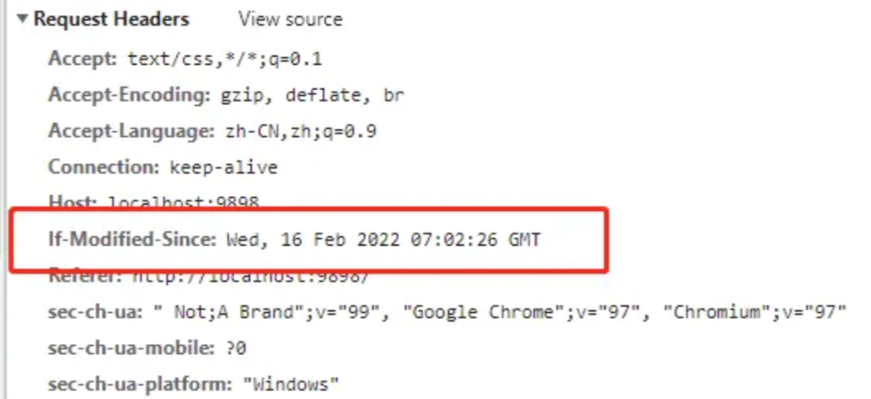

# HTTP（Hyper Text Transfer Protocol）的概念

超文本传输协议（Hyper Text Transfer Protocol，HTTP）是一个简单的请求-响应协议，它通常运行在[TCP](https://baike.baidu.com/item/TCP/33012)之上。它指定了客户端可能发送给服务器什么样的消息以及得到什么样的响应。

# 优缺点

## 特点

1. **「灵活可扩展」**。一个是语法上只规定了基本格式，空格分隔单词，换行分隔字段等。另外一个就是传输形式上不仅可以传输文本，还可以传输图片，视频等任意数据。
2. **「请求-应答模式」**，通常而言，就是一方发送消息，另外一方要接受消息，或者是做出相应等。
3. **「可靠传输」**，HTTP 是基于 TCP/IP，因此把这一特性继承了下来。
4. **「无状态」**，这个分场景回答即可。

## 缺点

1. **「无状态」**，有时候，需要保存信息，比如像购物系统，需要保留下顾客信息等等，另外一方面，有时候，无状态也会减少网络开销，比如类似直播行业这样子等，这个还是分场景来说。
2. **「明文传输」**，即协议里的报文(主要指的是头部)不使用二进制数据，而是文本形式。这让 HTTP 的报文信息暴露给了外界，给攻击者带来了便利。
3. **「队头阻塞」**，当 http 开启长连接时，共用一个 TCP 连接，当某个请求时间过长时，其他的请求只能处于阻塞状态，这就是队头阻塞问题。

# 版本差异

| **HTTP1.0**                                                                                                                                                                                                                                                                                                  | **HTTP1.1**                                                                                                                                                                                                                                                                                                                                                                                                                                                                                                                       | **HTTP2.0**                                                                                                                                                                                                                                                                                                                                                                      |
| ------------------------------------------------------------------------------------------------------------------------------------------------------------------------------------------------------------------------------------------------------------------------------------------------------------ | --------------------------------------------------------------------------------------------------------------------------------------------------------------------------------------------------------------------------------------------------------------------------------------------------------------------------------------------------------------------------------------------------------------------------------------------------------------------------------------------------------------------------------- | -------------------------------------------------------------------------------------------------------------------------------------------------------------------------------------------------------------------------------------------------------------------------------------------------------------------------------------------------------------------------------- |
| - 任何格式的内容都可以发送，这使得互联网不仅可以传输文字，还能传输图像、视频、二进制等文件。<br>- 除了 GET 命令，还引入了 POST 命令和 HEAD 命令。<br>- http 请求和回应的格式改变，除了数据部分，每次通信都必须包括头信息（HTTP header），用来描述一些元数据。<br>- 只使用 header 中的 If-Modified-Since 和 Expires 作为缓存失效的标准。<br>- **不支持断点续传**，也就是说，每次都会传送全部的页面和数据。<br>- 通常每台计算机只能绑定一个 IP，所以请求消息中的 URL 并没有传递主机名（hostname） | http1.1 是**目前最为主流**的 http 协议版本，从 1999 年发布至今，仍是主流的 http 协议版本。<br><br>- **引入了持久连接**（ persistent connection），即 TCP 连接默认不关闭，可以被多个请求复用，不用声明 Connection: keep-alive。长连接的连接时长可以通过请求头中的 keep-alive 来设置<br>- 引入了**管道机制**（ pipelining），即在同一个 TCP 连接里，客户端可以同时发送多个 请求，进一步改进了 HTTP 协议的效率。(引发队头阻塞)<br>- HTTP 1.1 中新增加了 E-tag，If-Unmodified-Since, If-Match, If-None-Match 等缓存控制标头来控制缓存失效。<br>- 支持**断点续传**，通过使用请求头中的 Range 来实现。<br>- 使用了虚拟网络，在一台物理服务器上可以存在多个虚拟主机（Multi-homed Web Servers），并且它们共享一个 IP 地址。<br>- 新增方法：PUT、 PATCH、 OPTIONS、 DELETE。 | - **二进制分帧** 这是一次彻底的二进制协议，头信息和数据体都是二进制，并且统称为"帧"：头信息帧和数据帧。<br>- **头部压缩** HTTP 1.1 版本会出现 **「User-Agent、Cookie、Accept、Server、Range」** 等字段可能会占用几百甚至几千字节，而 Body 却经常只有几十字节，所以导致头部偏重。HTTP 2.0 使用 HPACK 算法进行压缩。<br>- **多路复用** 复用 TCP 连接，在一个连接里，客户端和浏览器都可以同时发送多个请求或回应，且不用按顺序一一对应，这样子解决了队头阻塞的问题。<br>- **服务器推送** 允许服务器未经请求，主动向客户端发送资源，即服务器推送。<br>- **请求优先级** 可以设置数据帧的优先级，让服务端先处理重要资源，优化用户体验。 |

### http1.x 版本问题

- 在传输数据过程中，所有内容都是明文，客户端和服务器端都无法验证对方的身份，无法保证数据的安全性。
- HTTP/1.1 版本默认允许复用 TCP 连接，但是在同一个 TCP 连接里，所有数据通信是按次序进行的，服务器通常在处理完一个回应后，才会继续去处理下一个，这样子就会造成队头阻塞。
- http/1.x 版本支持 Keep-alive，用此方案来弥补创建多次连接产生的延迟，但是同样会给服务器带来压力，并且的话，对于单文件被不断请求的服务，Keep-alive 会极大影响性能，因为它在文件被请求之后还保持了不必要的连接很长时间。

HTTP/1.1 最大的变化就是引入了持久连接（persistent connection），在 HTTP/1.1 中默认开启 Connection: keep-alive，即 TCP 连接默认不关闭，可以被多个请求复用。

那么管道机制就是在同一个 TCP 连接中可以同时发送多个 HTTP 请求而不用等待上一个请求返回数据后，再发送下一个请求。虽然可以同时发送多个 HTTP 请求，但是服务器响应是按照请求的顺序进行响应的。

HTTP 2.0 的多路复用是在同一个 TCP 连接中，可以发送多个 HTTP 请求，而且请求的响应不依赖于前一个请求。每个请求单独处理，不会出现 HTTP1.1 中上一个请求没有回应便一直等待的情况。

参考： [「查缺补漏」巩固你的 HTTP 知识体系 - 掘金](https://juejin.cn/post/6857287743966281736)

http2 相较于 http1.1 的优势：

- 多路复用
- 头部压缩
- 服务器推送

# HTTP 缓存原理

## 强缓存

### 概念

强缓存由服务器将缓存字段加入**response header**中返回到浏览器，控制强缓存的有两个字段：

- Expires (HTTP1.0)
- Cache-Control(HTTP1.1)

浏览器解析到缓存字段后就在缓存设定的时间内只加载本地缓存

### 优先级

Cache-Control 的优先级要高于 Expires

### Expires

这个字段是 http1.0 规范中的字段，现在已经废弃，但是仍然可用，他的值是服务返回缓存失效的到期时间，也就是说再次发送请求如果当前时间小于 Expires 设置的时间，那么就是用当前缓存内容。

```js
// Koa 应用
app.use(async (ctx) => {
  const url = ctx.request.url
  if (url === '/') {
    // 访问根路径返回index.html
    ctx.set('Content-Type', 'text/html')
    ctx.body = await parseStatic('./index.html')
  } else {
    const filePath = path.resolve(__dirname, `.${url}`)
    // 设置类型
    ctx.set('Content-Type', parseMime(url))
    // 设置 Expires 响应头 这里设置了30秒
    const time = new Date(Date.now() + 30000).toUTCString()
    ctx.set('Expires', time)
    // 设置传输
    ctx.body = await parseStatic(filePath)
  }
})
```

**缺点：**由于 Expires 存的是服务器返回的时间，客户端要和服务端的时间进行对比，因此，如果没有 考虑时差问题会导致缓存失败

### Cache-Control

Cache-Control 有多个取值：

- **public：**所有内容都被缓存
- **private：**所有内容只能客户端缓存，Cache-Control 的默认取值
- **no-cache：**客户端缓存内容，但是是否使用缓存则需要经过协商缓存来验证决定（即强制使用协商缓存）
- **no-store：**所有内容都不会缓存（和`no-cache`互斥，不能同时设置）
- **max-age：**缓存内容在多少秒后失效，常用的一个配置
- **s-maxage**：决定代理服务器缓存的时长。

而我们最常用的还是用**max-age**设置缓存时间

```js
// Koa app
app.use(async (ctx) => {
  const url = ctx.request.url
  if (url === '/') {
    // 访问根路径返回index.html
    ctx.set('Content-Type', 'text/html')
    ctx.body = await parseStatic('./index.html')
  } else {
    const filePath = path.resolve(__dirname, `.${url}`)
    // 设置类型
    ctx.set('Content-Type', parseMime(url))
    // 设置 Cache-Control 响应头 单位为秒
    ctx.set('Cache-Control', 'max-age=30')
    // 设置传输
    ctx.body = await parseStatic(filePath)
  }
})
```

max-age 是一个相对时间，单位是秒，也就是说在 max-age 秒内再次发起该请求，则会直接使用缓存结果，强制缓存生效。

### memory cache 和 disk cache

强制缓存之后我们可以在浏览器控制台看到是否使用了缓存：



可以看到 disk cache 和 memory cache 都是强制缓存，加载速度极快，点开看 Response Header 可以看到缓存字段，现在一般都是只能看到 cache-control：



那么 disk cache 和 memory cache 的区别是什么呢

disk cache 是缓存在硬盘空间大持久，memory cache 是缓存在内存中，其实看 memory cache 加载时间多半是 0，因为内存读写速度很快，加载时间几乎为 0

而什么时候使用 disk cache 和 memory cache 呢，这个网上也找不到具体的策略，应该是各大浏览器自己定制的策略，但是有一些可以肯定：

1. 较大的文件优先缓存在硬盘里
2. 频繁使用的文件优先缓存在内存中
3. 当内存资源紧张时，资源优先缓存在硬盘里

[【精选】浏览器缓存(一)：强缓存 MEMORY CACHE 和 DISK CACHE*@memory.cache*懒人村杂货铺的博客-CSDN 博客](https://blog.csdn.net/weixin_47941995/article/details/123685120)

## 协商缓存



协商缓存是在没有命中强制缓存的时候由服务器判断是否使用缓存，一般有两种模式：

### 【Last-Modified，If-Modified-Since】

在客户端请求资源的时候，服务端会带上资源文件最后的修改时间，放在 Last-Modified 字段中，客户端拿到 Last-Modified 后在下次请求这个资源时会在请求头中以 If-Modified-Since 字段带上最后修改时间，服务器校验时间是否相同，相同则返回 304，客户端收到 304 就读取缓存，如果时间不一样则返回状态码 200 并返回最新文件。

代码实现：

```js
// Koa 获取文件信息
const getFileStat = (path) => {
  return new Promise((resolve) => {
    fs.stat(path, (_, stat) => {
      resolve(stat)
    })
  })
}

app.use(async (ctx) => {
  const url = ctx.request.url
  if (url === '/') {
    // 访问根路径返回index.html
    ctx.set('Content-Type', 'text/html')
    ctx.body = await parseStatic('./index.html')
  } else {
    const filePath = path.resolve(__dirname, `.${url}`)
    const ifModifiedSince = ctx.request.header['if-modified-since']
    const fileStat = await getFileStat(filePath)
    console.log(new Date(fileStat.mtime).getTime())
    ctx.set('Cache-Control', 'no-cache')
    ctx.set('Content-Type', parseMime(url))
    // 比对时间，mtime为文件最后修改时间
    if (ifModifiedSince === fileStat.mtime.toGMTString()) {
      ctx.status = 304
    } else {
      ctx.set('Last-Modified', fileStat.mtime.toGMTString())
      ctx.body = await parseStatic(filePath)
    }
  }
})
```

第一次请求的响应头：


第二次请求的请求头：



如果资源没改变则命中协商缓存返回 304：


### 【Etag，If-None-Match】

Etag 和 Last-Modified 非常相似，服务端在响应头中设置 Etag 字段，但是携带的是文件内容对应的 hash 值，客户端再次请求的时候会在请求头中带上 If-None-Match 字段，服务器收到后和最新的 hash 值对比，如果一样返回 304，不同则返回最新资源和 Etag

代码实现：

```js
const crypto = require('crypto')

app.use(async (ctx) => {
  const url = ctx.request.url
  if (url === '/') {
    // 访问根路径返回index.html
    ctx.set('Content-Type', 'text/html')
    ctx.body = await parseStatic('./index.html')
  } else {
    const filePath = path.resolve(__dirname, `.${url}`)
    const fileBuffer = await parseStatic(filePath)
    const ifNoneMatch = ctx.request.header['if-none-match']
    // 生产内容hash值
    const hash = crypto.createHash('md5')
    hash.update(fileBuffer)
    const etag = `"${hash.digest('hex')}"`
    ctx.set('Cache-Control', 'no-cache')
    ctx.set('Content-Type', parseMime(url))
    // 对比hash值
    if (ifNoneMatch === etag) {
      ctx.status = 304
    } else {
      ctx.set('etag', etag)
      ctx.body = fileBuffer
    }
  }
})
```

### 协商缓存二者的对比

【Last-Modified，If-Modified-Since】的性能更快，只需要获取文件修改时间就能对比，但是缺点和 Expires 一样，客户端的时间可能受时区和自己调整有影响

【Etag，If-None-Match】的优点是十分稳定，主要文件更改，对应的 hash 值一定会改变，所以文件改变肯定可以刷新缓存，但是缺点是根据内容生成 hash 相对来说更消耗性能

## 缓存的实际应用

对与频繁变动的资源：

使用 Cache-Control: no-cache，使浏览器每次都请求服务器，然后配合 ETag 或者 Last-Modified 来验证资源是否有效。这样的做法虽然不能节省请求数量，但是能显著减少响应数据大小。

对于不常变化的资源：

通常在处理这类资源时，给它们的 Cache-Control 配置一个很大的 max-age=31536000 (一年)，这样浏览器之后请求相同的 URL 会命中强制缓存。而为了解决更新的问题，就需要在文件名(或者路径)中添加 hash， 版本号等动态字符，之后更改动态字符，从而达到更改引用 URL 的目的，让之前的强制缓存失效 (其实并未立即失效，只是不再使用了而已)。

————————————————

参考：

[浏览器缓存：memory cache、disk cache、强缓存协商缓存等概念\_(memory cache)-CSDN 博客](https://blog.csdn.net/weixin_43972437/article/details/105513486)

https://zhuanlan.zhihu.com/p/376552862

# HTTP 底层 TCP/IP

[巩固你的网络底层基础，再不怕被问 TCP/IP/UDP - 掘金](https://juejin.cn/post/6994274756652433421)

# HTTP 和 HTTPS

[http 和 HTTPS](https://juejin.cn/post/6994629873985650696)

[我画了 13 张图，用最通俗易懂的话讲 HTTPS，拿下！](https://juejin.cn/post/7042158171778973732)

https://zhuanlan.zhihu.com/p/96494976
